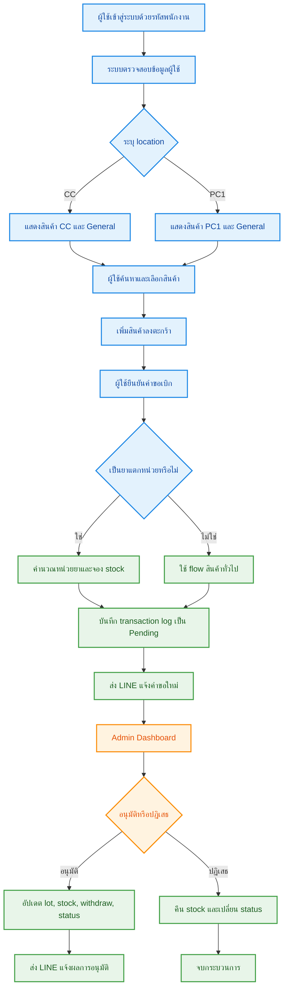
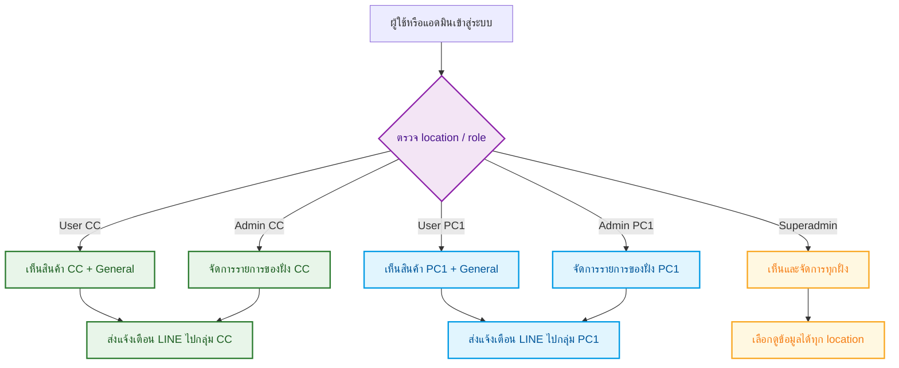
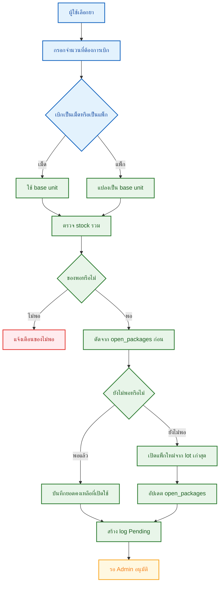
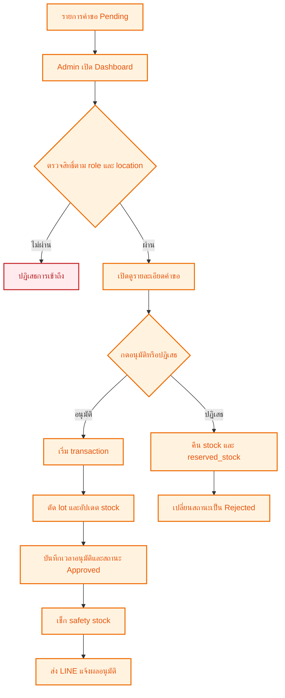
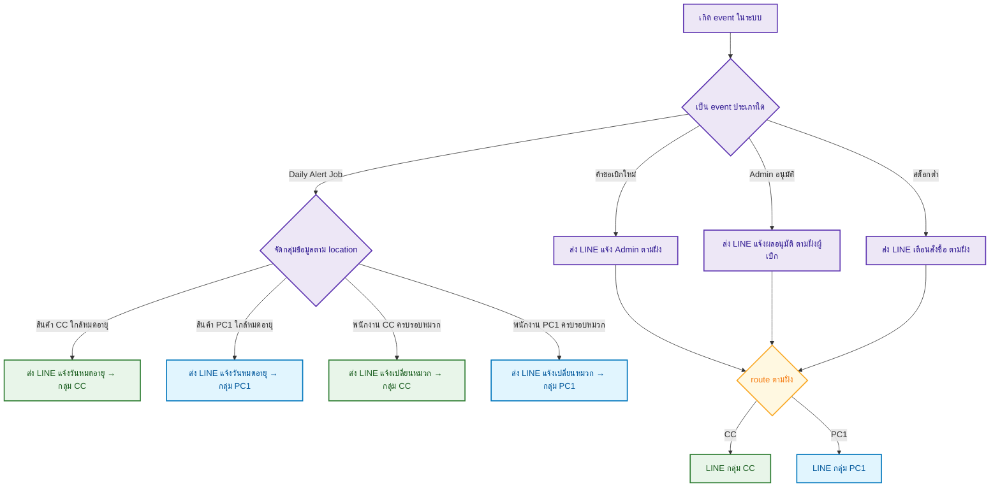

# เอกสารสรุปการทำงานระบบ Stock_PCM

> เอกสารฉบับนี้จัดทำขึ้นเพื่อใช้อธิบายภาพรวมการทำงานของระบบในเชิงวิชาการและเชิงปฏิบัติงาน

ระบบ Stock_PCM เป็นระบบสารสนเทศสำหรับบริหารจัดการการเบิกจ่ายสินค้า เวชภัณฑ์ และอุปกรณ์ที่เกี่ยวข้อง โดยรองรับการใช้งานแยกตามหน่วยงาน CC และ PC1 มีขั้นตอนการอนุมัติโดยผู้ดูแลระบบ รองรับการตัดสต็อกตามหลัก FIFO การจัดการยาแบบแตกหน่วย และการแจ้งเตือนผ่าน LINE ในหลายเหตุการณ์สำคัญของระบบ

| สีและสัญลักษณ์ | ความหมาย |
|---|---|
| 🔵 ผู้ใช้งาน | ขั้นตอนการใช้งานของพนักงาน |
| 🟢 ระบบประมวลผล | ขั้นตอนที่ระบบทำงานอัตโนมัติ |
| 🟠 ผู้ดูแลระบบ | ขั้นตอนของแอดมินหรือผู้อนุมัติ |
| 🔴 แจ้งเตือน/ความเสี่ยง | เหตุการณ์ผิดปกติหรือการปฏิเสธ |
| 🟣 จุดตัดสินใจ | เงื่อนไขที่ระบบใช้ตัดสินใจ |

---

## 1. 🎯 วัตถุประสงค์ของระบบ

ระบบนี้ได้รับการออกแบบเพื่อรองรับการดำเนินงานด้านคลังสินค้าและวัสดุสิ้นเปลืองอย่างมีประสิทธิภาพ โดยมีวัตถุประสงค์สำคัญดังต่อไปนี้

- เพื่อให้ผู้ใช้งานสามารถเบิกสินค้าและยาได้ผ่านระบบเว็บอย่างเป็นระบบ
- เพื่อกำหนดสิทธิ์การเข้าถึงข้อมูลและการจัดการตาม location ของผู้ใช้และผู้ดูแลระบบ
- เพื่อรองรับการเบิกยาแบบแตกหน่วย เช่น เบิกเป็นเม็ด แต่จัดเก็บเป็นห่อ แผง หรือขวด
- เพื่อควบคุมการตัดสต็อกตามหลัก FIFO และการใช้ของจากแพ็กที่เปิดแล้วอย่างเหมาะสม
- เพื่อให้ผู้ดูแลระบบสามารถอนุมัติหรือปฏิเสธคำขอได้อย่างตรวจสอบย้อนกลับได้
- เพื่อสนับสนุนการแจ้งเตือนผ่าน LINE ในเหตุการณ์สำคัญ เช่น คำขอใหม่ ผลการอนุมัติ สต็อกต่ำ วันหมดอายุ และอายุการใช้งานของหมวกนิรภัย

---

## 2. 🔄 ภาพรวมการทำงานของระบบ

### สาระสำคัญของกระบวนการ
- ผู้ใช้งานจะเห็นรายการสินค้าเฉพาะในส่วนงานที่ตนมีสิทธิ์เข้าถึง
- เมื่อผู้ใช้ยืนยันการเบิก ระบบจะบันทึกรายการเข้าสู่สถานะ Pending เพื่อรอการพิจารณา
- ผู้ดูแลระบบจะทำการอนุมัติหรือปฏิเสธคำขอตามสิทธิ์ของตน
- เมื่อได้รับการอนุมัติ ระบบจะอัปเดตสต็อกจริง พร้อมส่งการแจ้งเตือนผลการดำเนินการ

---

## 3. 🏭 การแยกการทำงานตามฝั่ง CC และ PC1

### หลักการแยกฝั่ง
- ฝั่ง CC เห็นและอนุมัติได้เฉพาะข้อมูลของ CC
- ฝั่ง PC1 เห็นและอนุมัติได้เฉพาะข้อมูลของ PC1
- Superadmin เห็นข้อมูลรวมทั้งหมด
- LINE จะ route ไปยังกลุ่มตามฝั่งที่เกี่ยวข้อง

---

## 4. Flow การเบิกสินค้าทั่วไป

1. ผู้ใช้เลือกสินค้า
2. ระบบเพิ่มลงตะกร้า
3. ระบบจอง stock และเพิ่ม reserved_stock
4. ผู้ใช้กดยืนยันคำขอ
5. ระบบสร้าง transaction_logs เป็น Pending
6. ส่ง LINE แจ้งแอดมิน
7. แอดมินกดอนุมัติหรือปฏิเสธ
8. ระบบอัปเดตสถานะเป็น Approved หรือ Rejected

---

## 5. Flow การเบิกยาแบบ FIFO และแตกหน่วย

### 5.1 เงื่อนไขที่เข้าสู่ flow ยา
- สินค้าอยู่ในหมวด ยา
- มี conversion_rate มากกว่า 1
- มีหน่วยหลัก/หน่วยย่อย เช่น ห่อ และ เม็ด

### 5.2 ผังการคำนวณแบบแนวตั้ง

### 5.3 หลัก FIFO ที่ระบบใช้จริง

#### ชั้นที่ 1: open_packages
- ใช้ของจากแพ็กที่เปิดอยู่ก่อน
- เลือกจากรายการที่เปิดไว้เก่าที่สุด

#### ชั้นที่ 2: product_lots
- เมื่อต้องเปิดแพ็กใหม่หรือแอดมินอนุมัติ ระบบจะอ้างอิง lot เก่าสุดก่อน
- เรียงตาม received_date จากเก่าไปใหม่

---

## 6. ✅ Flow การอนุมัติของ Admin

### สิ่งที่ระบบทำเมื่อแอดมินกดอนุมัติ
- เปลี่ยนสถานะรายการเป็น Approved
- บันทึก lot ที่ถูกใช้
- เพิ่มค่า withdraw ของสินค้า
- ตรวจ stock ต่ำกว่า safety stock
- ส่ง LINE แจ้งผลกลับไปยังกลุ่มที่ถูกต้อง

### สิ่งที่ระบบทำเมื่อแอดมินกดปฏิเสธ
- คืน stock หรือ reserved_stock ตามชนิดสินค้า
- เปลี่ยนสถานะเป็น Rejected
- ไม่ตัดสต็อกจริง

---

## 7. 🔔 ระบบแจ้งเตือน LINE และงานแจ้งเตือนอัตโนมัติ

ระบบปัจจุบันมีการแจ้งเตือนหลักดังนี้:

1. ตอนผู้ใช้ส่งคำขอเบิกใหม่
2. ตอนแอดมินอนุมัติคำขอ (แจ้งตรงไปยังกลุ่ม LINE ของฝั่งผู้เบิก)
3. ตอน stock ต่ำกว่า safety stock
4. ตอนสินค้าใกล้หมดอายุ (Daily Alert — แยกส่งแต่ละฝั่ง)
5. ตอนหมวกนิรภัยครบอายุการใช้งาน (Daily Alert — แยกส่งแต่ละฝั่ง)

### Mermaid แสดงการแจ้งเตือนแบบแนวตั้ง

### รายละเอียดการแจ้งเตือน

#### แจ้งเตือนวันหมดอายุ (Daily Alert)
- ตรวจสอบจากตาราง `product_lots` (รองรับทั้ง lot เก่าและ lot ใหม่)
- แจ้งล่วงหน้าก่อนหมดอายุภายใน 30 วัน
- **แยกส่งแต่ละฝั่ง**: สินค้า location CC → LINE กลุ่ม CC, สินค้า location PC1 → LINE กลุ่ม PC1
- ป้องกันการสับสนของข้อมูลระหว่าง 2 ฝั่ง

#### แจ้งเตือนอายุการใช้งานหมวกนิรภัย (Daily Alert)
- ตรวจจากประวัติการเบิกที่อนุมัติแล้ว โดยเทียบกับ location ของพนักงาน
- แจ้งเตือนเมื่อครบ 2 ปี (23 เดือนขึ้นไปนับจากวันเบิก)
- **แยกส่งแต่ละฝั่ง**: พนักงาน location CC → LINE กลุ่ม CC, พนักงาน location PC1 → LINE กลุ่ม PC1

#### หน่วยสินค้าในการแจ้งเตือนอนุมัติ
- ระบบใช้ฟังก์ชัน `is_split_tablet_medicine()` เพื่อตรวจว่าสินค้าเป็นยาแตกหน่วยหรือไม่
- สินค้าทั่วไปจะแสดงหน่วยจาก `products.unit` (เช่น gallon, ชิ้น)
- ยาแตกหน่วยจะแสดงหน่วยจาก `products.base_unit` (เช่น เม็ด) ป้องกันหน่วยผิดพลาด

---

## 8. โครงสร้างตารางหลักในฐานข้อมูล

### users
- ข้อมูลพนักงาน
- department
- location
- สถานะ lock การใช้งาน

### products
- stock
- reserved_stock
- withdraw
- base_unit
- package_unit
- conversion_rate
- location
- expiry_date

### carts
- รายการที่ผู้ใช้เลือกก่อนยืนยัน

### product_lots
- เก็บข้อมูล lot เพื่อใช้ FIFO
- เก็บ received_date และ expiry_date

### open_packages
- เก็บจำนวนคงเหลือของแพ็กที่ถูกเปิดแล้ว

### transaction_logs
- request log
- approved / rejected log
- medicine audit log
- helmet usage history

---

## 9. สรุปผลการพัฒนาระบบในปัจจุบัน

จากการปรับปรุงล่าสุด ระบบสามารถรองรับการทำงานที่สำคัญได้อย่างครบถ้วน ดังนี้

- รองรับการใช้งานทั้งหน่วยงาน CC และ PC1
- กำหนดสิทธิ์ผู้ดูแลระบบแยกตามฝั่งการใช้งาน
- รองรับการแจ้งเตือน LINE แยกตามกลุ่มงาน
- รองรับการเบิกยาแบบแตกหน่วย เช่น เม็ด ห่อ หรือแผง
- ใช้หลัก FIFO ผ่านทั้ง open_packages และ product_lots
- มีระบบอนุมัติและปฏิเสธคำขออย่างเป็นลำดับขั้น
- มีการแจ้งเตือนเมื่อสต็อกต่ำกว่าระดับที่กำหนด
- มีการแจ้งเตือนสินค้าที่ใกล้หมดอายุ **แยกฝั่ง CC / PC1** (ตรวจจาก product_lots)
- มีการแจ้งเตือนหมวกนิรภัยครบอายุการใช้งาน **แยกฝั่ง CC / PC1** (ตรวจจาก location พนักงาน)
- การแสดงหน่วยสินค้าในการแจ้งเตือนอนุมัติใช้ `is_split_tablet_medicine()` เพื่อความถูกต้อง
- แผนภาพ Mermaid ถูกปรับเป็นแนวตั้งเพื่อให้อ่านและนำเสนอได้ชัดเจนมากขึ้น

---

## 10. บทสรุป

ระบบ Stock_PCM ได้รับการพัฒนาให้สามารถตอบสนองต่อการบริหารจัดการคลังสินค้าและการเบิกจ่ายวัสดุในองค์กรได้อย่างเป็นระบบ มีความเหมาะสมทั้งในด้านการใช้งานจริง การควบคุมสิทธิ์ การตรวจสอบย้อนหลัง และการแจ้งเตือนเชิงป้องกัน ทั้งนี้ เอกสารฉบับนี้สามารถใช้เป็นข้อมูลประกอบการนำเสนอผลงาน การส่งรายงาน หรือการอธิบายกระบวนการทำงานของระบบแก่ผู้เกี่ยวข้องได้อย่างเหมาะสม

