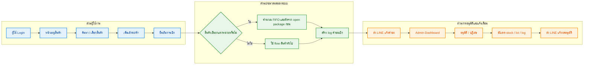
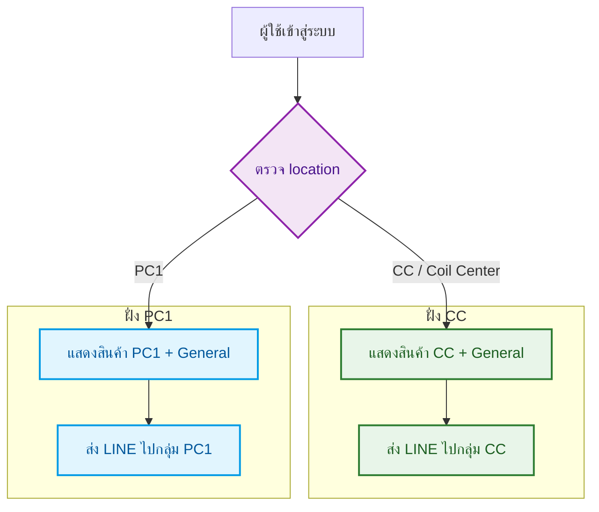
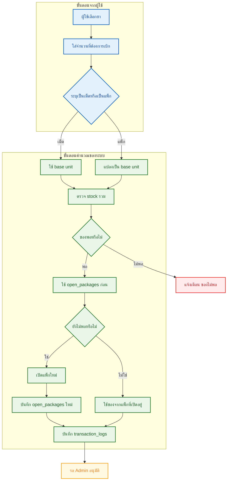
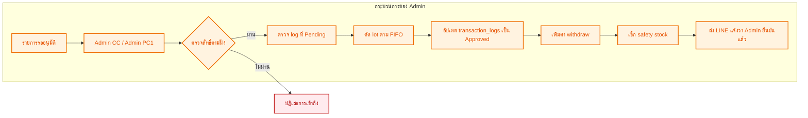
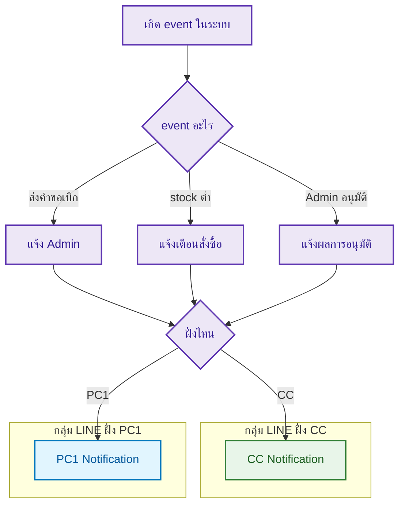

# 🏥 เอกสารสรุปการทำงานระบบ Stock_PCM

> เวอร์ชันนี้จัดรูปแบบให้อ่านง่ายขึ้น เหมาะสำหรับใช้ส่งงาน อธิบายระบบ หรือแนบประกอบโปรเจกต์

ระบบ Stock_PCM เป็นเว็บไซต์สำหรับจัดการการเบิกจ่ายสินค้าและยา โดยรองรับทั้งฝั่ง **CC** และ **PC1** พร้อมระบบ **FIFO**, **Admin Approval**, และ **LINE Notification** แยกตามกลุ่มงาน

---

## 1. วัตถุประสงค์ของระบบ

ระบบนี้ถูกออกแบบมาเพื่อให้สามารถ:
- จัดการการเบิกสินค้าและยาได้จากหน้าเว็บ
- แยกสิทธิ์การทำงานตาม location ของผู้ใช้
- รองรับการเบิกยาแบบแตกหน่วย เช่น เบิกเป็น **เม็ด** แต่เก็บเป็น **ห่อ / แผง / ขวด**
- ใช้หลัก **FIFO** ในการจ่ายยา
- ให้ Admin อนุมัติรายการก่อนสรุปผล
- แจ้งเตือนผ่าน LINE แยกเป็น 2 กลุ่ม คือ **CC** และ **PC1**

---

## 2. ภาพรวมการทำงานของเว็บไซต์

### ใจความสำคัญ
- ผู้ใช้เริ่มจาก login ด้วยรหัสพนักงาน
- ระบบกรองสินค้าให้ตามฝั่ง **CC** หรือ **PC1**
- เมื่อเบิกยา ระบบจะคำนวณ FIFO โดยอัตโนมัติ
- เมื่อ Admin อนุมัติ ระบบจะอัปเดตฐานข้อมูลและส่ง LINE แจ้งผล

---

## 3. การแยกการทำงานตามฝั่ง CC และ PC1

### หลักการแยกฝั่ง
- ถ้าผู้ใช้มาจาก **CC** → เห็นสินค้า CC และแจ้งเตือน LINE ไปกลุ่ม CC
- ถ้าผู้ใช้มาจาก **PC1** → เห็นสินค้า PC1 และแจ้งเตือน LINE ไปกลุ่ม PC1
- Admin แต่ละฝั่งอนุมัติได้เฉพาะรายการของฝั่งตัวเอง

---

## 4. Flow การเบิกสินค้าทั่วไป

การเบิกของทั่วไปมีลำดับดังนี้

1. ผู้ใช้เลือกสินค้า
2. ระบบเพิ่มรายการลงตะกร้า
3. stock ถูกลดทันที
4. reserved_stock ถูกเพิ่ม
5. ผู้ใช้กดยืนยันการเบิก
6. ระบบสร้างรายการรออนุมัติใน log
7. ส่ง LINE แจ้ง Admin
8. เมื่อ Admin อนุมัติ รายการจะเปลี่ยนเป็น **Approved**

---

## 5. Flow การเบิกยาแบบ FIFO

### 5.1 เงื่อนไขที่ระบบมองว่าเป็นยาแตกหน่วย
สินค้าจะเข้าสู่ flow นี้เมื่อ:
- อยู่ในหมวด **ยา**
- มีค่า **conversion_rate > 1**
- หน่วยแพ็กเป็นลักษณะ เช่น **ห่อ, แผง, ซอง, ขวด, กล่อง, กระปุก**

### 5.2 ผังการคำนวณ FIFO

### 5.3 หลัก FIFO ที่ระบบใช้จริง

#### ชั้นที่ 1: open_packages
- ใช้ของจากแพ็กที่เปิดอยู่ก่อน
- เลือกจากรายการที่เปิดไว้เก่าที่สุด

#### ชั้นที่ 2: product_lots
- ตอน Admin อนุมัติ ระบบจะตัด lot แบบ FIFO
- เรียงตาม received_date จากเก่าไปใหม่

---

## 6. ตัวอย่างจริง: มายบาซิน

### ข้อมูลสินค้า
- ชื่อสินค้า: **Throat Lozenge / ยาอมแก้เจ็บคอ มายบาซิน**
- หน่วยแพ็ก: **ห่อ**
- หน่วยย่อย: **เม็ด**
- อัตราแปลง: **1 ห่อ = 70 เม็ด**

### ตัวอย่างสถานะก่อนเบิก
- stock แบบห่อ = 0
- open package เหลือ = 60 เม็ด

### ผู้ใช้เบิก
- เบิก **10 เม็ด**

### ผลลัพธ์ที่เกิดขึ้น
- ระบบใช้ของจากห่อที่เปิดอยู่ก่อน
- จำนวนใน open package เปลี่ยนจาก **60 → 50 เม็ด**
- ไม่ต้องเปิดห่อใหม่

### ตัวอย่างข้อความ LINE
- **จำนวน: 10 เม็ด**
- **เบิกจากห่อที่เปิดแล้ว 10 เม็ด**

---

## 7. Flow การอนุมัติของ Admin

### สิ่งที่ระบบทำเมื่อ Admin กดอนุมัติ
- เปลี่ยนสถานะรายการเป็น **Approved**
- บันทึกเวลาอนุมัติ
- อัปเดต lot ที่ถูกใช้
- เพิ่มค่า withdraw ของสินค้า
- ตรวจสอบว่า stock ต่ำกว่า safety stock หรือไม่
- ส่ง LINE แจ้งผลกลับไปยังกลุ่มที่ถูกต้อง

---

## 8. ระบบแจ้งเตือน LINE

ระบบส่งข้อความหลัก 3 ช่วง

1. **ตอนผู้ใช้ส่งคำขอเบิก**
2. **ตอน stock ต่ำกว่า safety stock**
3. **ตอน Admin ยืนยันรายการแล้ว**

### Mermaid แสดงการ routing ของ LINE

---

## 9. โครงสร้างตารางหลักในฐานข้อมูล

### users
- ข้อมูลพนักงาน
- department
- location
- สถานะ lock การใช้งาน

### products
- stock
- reserved_stock
- withdraw
- base_unit
- package_unit
- conversion_rate
- location

### carts
- รายการที่ผู้ใช้เลือกก่อนยืนยัน

### product_lots
- เก็บข้อมูล lot เพื่อใช้ FIFO

### open_packages
- เก็บจำนวนคงเหลือของแพ็กที่ถูกเปิดแล้ว

### transaction_logs
- request log
- approved log
- medicine audit log

---

## 10. สรุปความสามารถของระบบในปัจจุบัน

✅ รองรับทั้ง **CC** และ **PC1**  
✅ แจ้งเตือน LINE แยก 2 กลุ่มได้แล้ว  
✅ เบิกยาแบบแตกหน่วยได้ เช่น **เม็ด**  
✅ มีการบังคับกรอกอาการเมื่อเบิกยา  
✅ FIFO ทำงานผ่านทั้ง **open_packages** และ **product_lots**  
✅ Admin อนุมัติแล้วมี LINE แจ้งกลับ  
✅ ข้อความ LINE แสดงหน่วยจริงได้ถูกต้อง เช่น **10 เม็ด**

