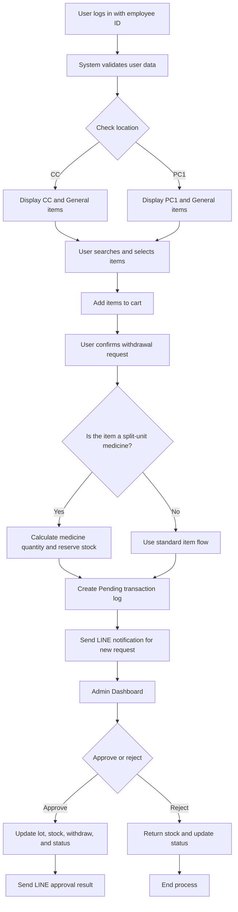
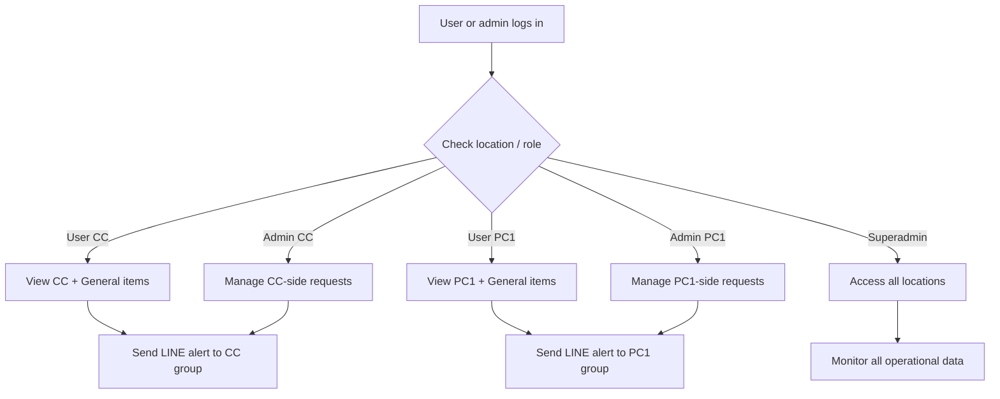
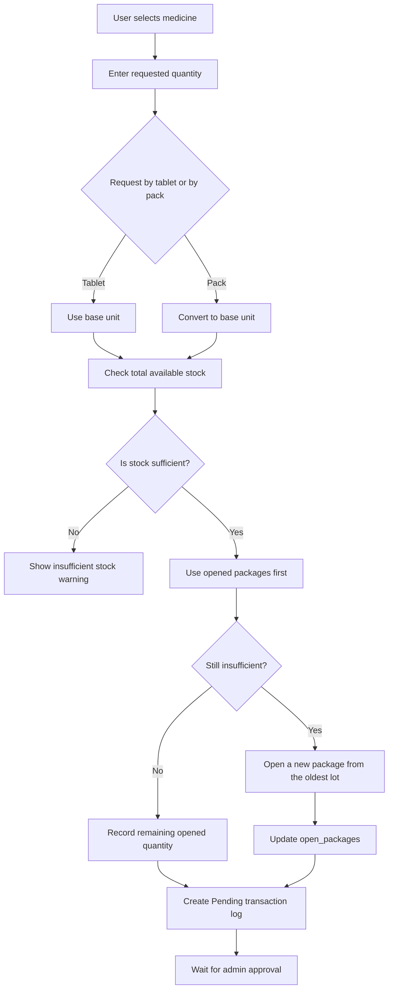
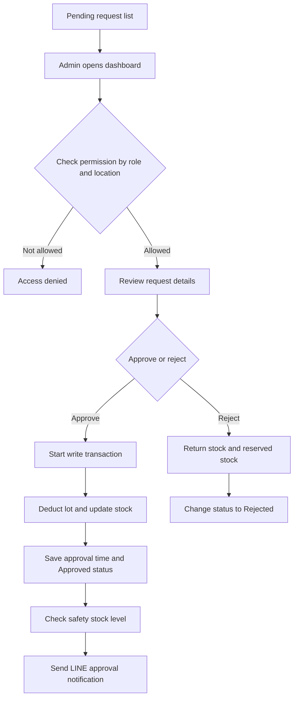
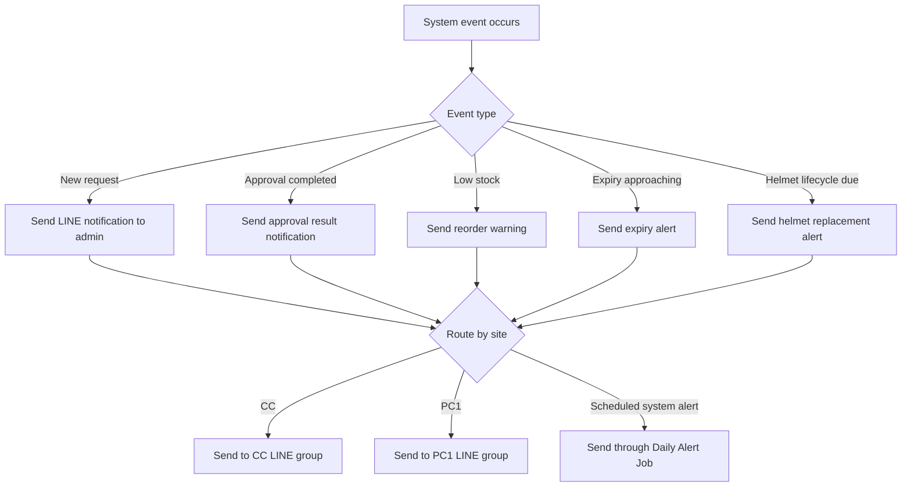

# Stock_PCM System Workflow Summary

> This document is prepared as a formal English version for supervisors, managers, and stakeholders who require a clear overview of the current system workflow and operational logic.

Stock_PCM is a web-based inventory and withdrawal management system for general supplies, medicines, and safety-related items. The system supports both CC and PC1 operational areas, includes admin approval workflow, FIFO-based stock handling, split-unit medicine dispensing, and LINE notification alerts for key system events.

| Color and Symbol | Meaning |
|---|---|
| 🔵 User Flow | Employee-facing actions and usage flow |
| 🟢 System Process | Automated system processing steps |
| 🟠 Admin Action | Approval and administrative actions |
| 🔴 Alert / Risk | Warning, rejection, or exception scenarios |
| 🟣 Decision Point | Logical decision conditions |

---

## 1. 🎯 System Objectives

The system has been designed to support the following objectives:

- To manage supply and medicine withdrawals through a web-based interface
- To separate access control and visibility by user and admin location
- To support split-unit medicine withdrawal, such as dispensing tablets while storing items by pack, strip, bottle, or box
- To control stock movement using FIFO and opened-package logic
- To allow administrators to approve or reject requests in a traceable workflow
- To provide LINE notifications for new requests, approval results, low stock, expiry alerts, and safety helmet lifecycle alerts

---

## 2. 🔄 Overall System Workflow

### Key Process Summary
- Users can only view items available to their authorized location
- Once a request is submitted, the system records it as Pending
- Administrators review and either approve or reject each request
- If approved, the system updates actual stock and sends a notification result

---

## 3. 🏭 Location-Based Separation: CC and PC1

### Location Logic
- CC users and admins operate within CC-related data
- PC1 users and admins operate within PC1-related data
- Superadmin can monitor and manage all locations
- LINE routing is handled according to the relevant operational site

---

## 4. Standard Item Withdrawal Flow

1. The user selects an item
2. The system adds the item to the cart
3. Stock is reserved and tracked in reserved_stock
4. The user confirms the withdrawal request
5. The system creates a Pending transaction log
6. A LINE notification is sent to the admin group
7. The admin approves or rejects the request
8. The final status is updated to Approved or Rejected

---

## 5. FIFO and Split-Unit Medicine Flow

### 5.1 Conditions for split-unit medicine handling
This workflow is applied when:
- The item belongs to the medicine category
- The conversion_rate is greater than 1
- The item uses package and base units, such as pack and tablet

### 5.2 Vertical Mermaid Flow

### 5.3 Actual FIFO logic used in the system

#### Level 1: open_packages
- The system uses already opened packages first
- It prioritizes the oldest opened package record

#### Level 2: product_lots
- When a new package must be opened or approval is processed, the system references the oldest lot first
- Lots are ordered by received_date from oldest to newest

---

## 6. ✅ Admin Approval Workflow

### What happens when an admin approves
- The request status is changed to Approved
- The used lot is recorded
- The withdraw value is updated
- Low-stock condition is checked
- The approval result is sent via LINE

### What happens when an admin rejects
- Stock or reserved stock is restored, depending on item type
- The request status is changed to Rejected
- No actual stock deduction is finalized

---

## 7. 🔔 LINE Notifications and Automatic Alert Jobs

The current system supports the following notification types:

1. New withdrawal request notification
2. Approval result notification
3. Low stock warning
4. Product expiry alert
5. Safety helmet lifecycle alert

### Vertical Mermaid Notification Flow

### Additional notification details

#### Expiry notification
- The system checks items that contain expiry_date
- Alerts are generated for items approaching expiry within 30 days
- This applies especially to medicines and expiry-controlled materials

#### Safety helmet lifecycle notification
- The system reviews approved helmet withdrawal history
- Alerts are generated when a helmet is near or has reached its replacement cycle
- This supports practical safety compliance in daily operations

---

## 8. Main Database Structure

### users
- Employee information
- Department
- Location
- Lock / active usage status

### products
- Stock
- Reserved stock
- Withdraw count
- Base unit
- Package unit
- Conversion rate
- Location
- Expiry date

### carts
- Temporary user cart items before confirmation

### product_lots
- Lot-based records for FIFO management
- Includes received_date and expiry_date

### open_packages
- Remaining quantity from already opened packages

### transaction_logs
- Request log
- Approved / rejected log
- Medicine audit records
- Helmet usage history

---

## 9. Current System Capabilities

At the current stage, the system supports the following functions:

- Operation for both CC and PC1 areas
- Role-based admin separation by location
- LINE notifications routed by operational site
- Split-unit medicine withdrawal handling
- FIFO control through both open_packages and product_lots
- Approval and rejection workflow for requests
- Low stock warning logic
- Expiry-date notification support
- Safety helmet lifecycle alert support
- Vertical Mermaid workflow diagrams for clear presentation

---

## 10. Conclusion

Stock_PCM has been developed to support real operational inventory and withdrawal control in a structured and auditable manner. The system provides practical benefits in stock visibility, location-based access control, approval workflow, FIFO-based medicine handling, and preventive notification alerts. This document may be used as a formal reference for presentations, reporting, management review, or project submission.